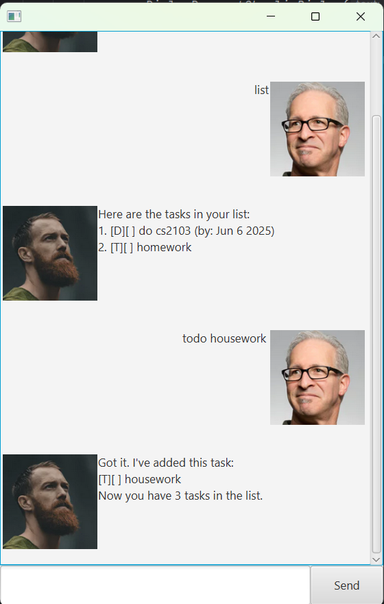

# **Charlie User Guide**

*A simple task manager chatbot for efficient productivity.*


*(Replace with an actual screenshot of your application.)*

## **Introduction**

Charlie is a chatbot designed to help users manage tasks efficiently. It supports **To-Dos, Deadlines, and Events**, and
allows users to list or delete tasks easily.

---

## **Features**

### **1. Adding a To-Do**

Create a simple to-do task without a deadline.

#### **Usage:**

```plaintext
todo <task description>
```

#### **Example:**

```plaintext
todo Buy groceries
```

#### **Expected Output:**

```plaintext
Got it! I've added this task:
[T][ ] Buy groceries
Now you have 1 task in the list.
```

---

### **2. Adding a Deadline**

Create a task with a specified deadline.

#### **Usage:**

```plaintext
deadline <task description> /by <time>
```

#### **Example:**

```plaintext
deadline Finish assignment /by 2025-02-21
```

#### **Expected Output:**

```plaintext
Got it! I've added this task:
[D][ ] Finish assignment (by: Feb 21 2025)
Now you have 2 tasks in the list.
```

---

### **3. Adding an Event**

Create an event that spans a specific time range.

#### **Usage:**

```plaintext
event <task description> /from <start time> /to <end time>
```

#### **Example:**

```plaintext
event Team meeting /from 2pm /to 4pm
```

#### **Expected Output:**

```plaintext
Got it! I've added this task:
[E][ ] Team meeting (from: 2pm to: 4pm)
Now you have 3 tasks in the list.
```

---

### **4. Deleting a Task**

Remove a specific task from the list.

#### **Usage:**

```plaintext
delete <task number>
```

#### **Example:**

```plaintext
delete 2
```

#### **Expected Output:**

```plaintext
Noted! I've removed this task:
[D][ ] Finish assignment (by: Feb 21 2025)
Now you have 2 tasks in the list.
```

---

### **5. Listing All Tasks**

View all tasks currently stored.

#### **Usage:**

```plaintext
list
```

#### **Expected Output:**

```plaintext
Here are the tasks in your list:
1. [T][ ] Buy groceries
2. [E][ ] Team meeting (from: 2pm to: 4pm)
```

---

### **6. Exiting the Chatbot**

End the session with Charlie.

#### **Usage:**

```plaintext
bye
```

#### **Expected Output:**

```plaintext
Goodbye! Hope to see you again soon!
```

---

## **Installation & Usage**

1. Download and extract `Charlie.jar`.
2. Open a terminal or command prompt in the extracted folder.
3. Run the chatbot using:
   ```sh
   java -jar Charlie.jar
   ```
4. Start managing your tasks!


